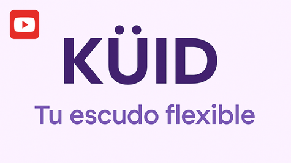

# [KÜID: Tu escudo flexible - Frontend](https://kuid-juanlora1-icesieducos-projects.vercel.app)

**Prototipo interactivo:** https://kuid-juanlora1-icesieducos-projects.vercel.app

---

## Integrantes

- Juan Diego Lora Lara
- Santiago Prado Larrarte
- Yuluka Gigante Muriel

---

## Acerca de KÜID

Incentivados por el reto planteado por **_Global Seguros_**, creamos **KÜID**, una experiencia de protección que se **adapta a tu estilo de vida**, no al revés. Desde el primer momento, una app con onboarding emocional y lenguaje simple te permite armar tu plan como un combo personalizado: solo agregas lo que realmente necesitas (salud, ingresos, hijos, mascotas, etc.) y puedes activarlo o pausarlo según tu realidad diaria. 

La plataforma se integra con tu realidad y herramientas cotidianas. Tus apps, wearables, pagos y datos financieros (si así lo decides), forman parte de la experiencia de protección. **KÜID** se basa en los datos recopilados para darte recomendaciones en tiempo real, alertarte sobre riesgos y premiarte por hábitos saludables o decisiones responsables.

Además, cuentas con asistencia humana directa, contratos transparentes y coberturas explicadas con historias reales y ejemplos simples. **Si no usas tu seguro, tranquilo**, parte de tu dinero se convierte en ahorro o cashback. Y si lo compartes en grupo (familia, comunidad laboral, colectivo), accedes a beneficios compartidos y precios más bajos.

Con nosotros, **protegerse deja de ser un trámite** y se convierte en una experiencia de cuidado activo, inteligente y cercana.

---

## Acerca del proyecto

Por el momento, **KÜID** se encuentra en su etapa de validación y evaluación, por lo que está disonible un MVP funcional que busca familiarizar a nuevos usuarios con esta propuesta tan innovadora, y enamorarlos de nuestra visión sin límites.

Este repositorio contiene la Interfaz Gráfica de Usuario del sistema que se encuentra en desarrollo y está preparada para ilustrar las funcionalidades clave del sistema (algunas funcionales y otras simuladas). Se encuentra desarrollada en React con Vite.

## Demostración 

Si desea explorar la aplicación por su cuenta, puede hacerlo [accediendo a este enlace](https://kuid-juanlora1-icesieducos-projects.vercel.app). Puede crear su propio usuario, o acceder con las siguientes credenciales:

- **Correo:** juanperez@gmail.com
- **Password:** 123456

A continuación encontrará un **VIDEO DE DEMOSTRACIÓN** del funcionamiento del sistema: 

**Nota:** Dado el plazo de tiempo limitado para la entrega del proyecto, muchas de las funcionalidades clave están siendo simuladas. Sin embargo, otras fueron implementadas, como lo es el RAG para el chat del usuario y sus preguntas con respecto a la aplicación.
